# 着手の仕分けと、最初の画面までのファイル順

初級者向けの通し解説は [`repository-guide.md`](repository-guide.md) です。このファイルは、同じ内容を短く残したメモです。会話の全文は `docs/chats/` に残ります。

この順は git の履歴ではありません。アプリのコードは 2026-10-08 のコミット `7d62e7e` にまとめて入っています。順は `docs/portfolio-plan.md` の 118行目と、各ファイルが参照しているものから組んでいます。118行目は、`/login` と `/dashboard` から作り、RBAC の骨格を先に固める、と書いてあります。

## 設計書の文を4つに分ける

コードを書く前に、文を1つ取り、見出しと日付で印を付けます。

- **今回.** 「初回公開」「Phase 1」「決定済み」と書いてあるもの。最初に動くものへ入れます。
- **後続.** 「第2段階」「初回に含めない」と書いてあるもの。リポジトリに入れません。
- **未決.** 「未決」「要確認」と書いてあるもの。実装の前提にしません。
- **計画とコードのずれ.** 計画は必須なのに、今のコードがまだやっていない、と README が書いているもの。コードの省略を、計画の決定として覚えません。

`docs/portfolio-plan.md` での例です。

| 文 | 印 | 根拠 |
|---|---|---|
| 初回は Phase 1 のみ。Stripe と AI は入れない | 今回の制約 | 21行目。2026-10-05 決定 |
| 必須画面は `/login` から `/settings` まで8つ | 今回の成果物 | 40行目 |
| `/login` と `/dashboard` から作り、RBAC の骨格を先に固める | 実装の最初の塊 | 118行目 |
| OpenAI、Stripe、Resend | 後続 | 38行目。初回公開後 |
| Supabase | 計画では必須スタック。今のコードは未接続 | 計画 32行目。README は未接続と書いている |
| 応募チャネル、週の稼働、海外案件の開始時期 | 未決 | 126行目から128行目 |

Supabase の行が、この仕分けの中身です。計画の必須スタックと、今の JSON ファイル保存は別の決定です。JSON は、認証情報がないため今のコードが採った代替です。計画がフォルダ構成として指定した形ではありません。

計画の日付は 2026-10-04 と 2026-10-05 です。アプリのコードはそのあとの `7d62e7e` です。設計書が先にあるので、初期化コマンドより仕分けが先です。

仕分けのあとには3つ続きます。

1. **初期化.** 「今回」に入った Next.js、TypeScript、Tailwind、shadcn/ui だけを足します。後続の Stripe や AI 用のパッケージは入れません。
2. **実装順.** 118行目のとおり、最初に動かすのは `/login`、`/dashboard`、RBAC の骨格です。資産の貸出や発送は、そのあとです。
3. **フォルダ.** その最初の塊が置くファイルだけを作ります。画面は `src/app`、権限と状態遷移はテストできるファイル、Server Actions はロール確認のあとでその規則を呼ぶ、という README 29行目の分担です。

## 画面にまだ無いものをファイルにする

繰り返す質問は1つです。この画面が仕事を終えるには、まだ手元にないものは何か。

ないものが画面なら、ページを書きます。ないものが人と許可なら、その形のファイルを先に書きます。ないものが保存された行なら、保存を書きます。未ログインはログインへ戻り、ログイン済みはダッシュボードに名前が出るところまで来たら、その塊は終わりです。

### 最初に開く画面を2つ書く

最初に開く画面はログインです。入れたあとに見る画面はダッシュボードです。先に書くのはこの2ページです。

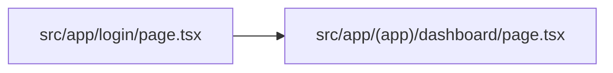

### 名前を出すためにユーザーを読む

ダッシュボードは、見ている人の名前がないと仕事が終わりません。クッキーからユーザーを読むファイルが要ります。`requireUser` は、ユーザーがいなければ `/login` へ戻します。

```ts
export async function requireUser(): Promise<User> {
  const user = await currentUser();
  if (!user) redirect("/login");
  return user;
}
```

この関数は `src/server/session.ts` の 25行目から 28行目です。

ログイン画面が同じ読み込みの中にあると、戻った先でまた戻ります。だからこの読み込みは `src/app/(app)/layout.tsx` に置き、ログインはグループの外に置きます。

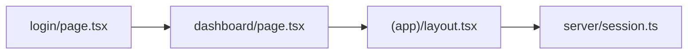

### 許可の表を画面へばらす前に1つ書く

ユーザーが要る、と分かった時点で、その人が何を許されるかも要ります。計画の 104行目から 113行目が、4ロールと「ロールと操作の対応で十分」と書いてあります。ロールごとの条件を画面へばらす前に、`User` と `can` を1つのファイルへ書きます。後の画面はこの関数を呼びます。

```ts
export function can(role: RoleId, capability: Capability): boolean {
  return roleCapabilities[role].includes(capability);
}
```

この関数は `src/domain/model.ts` の 98行目から 100行目です。

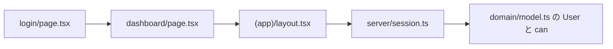

### 照合する行と、クッキーの出入り口を書く

ログインは、入力を誰かの行と照合できないと終わりません。行の置き場が次のファイルです。計画の必須スタックは Supabase です。今のコードは、認証情報がないため `src/domain/seed.ts` のデモ利用者と `src/server/db.ts` の JSON です。照合してクッキーを書くのが `login` です。クッキーの無いリクエストをログインへ戻すのが `src/proxy.ts` です。`proxy` はクッキーの有無だけを見ます。中身が壊れた id は `requireUser` が読み直し、利用者でなければログインへ戻します。

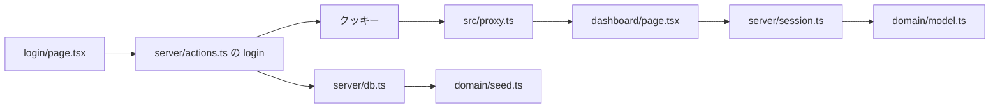

今のダッシュボードは、名前に加えて資産の件数も読んでいます。名前が出るところまでが、ログインの塊の終わりです。件数と一覧は次の節です。

## 件数と一覧を、まだ無いものから足す

ログインの塊が閉じたあとも、質問は同じです。この画面が仕事を終えるには、まだ手元にないものは何か。

### 4つの数字には、ステータスと資産の行が要る

ダッシュボードは、計画の4ステータスごとに件数を出します。利用者の名前だけでは、その数字は出ません。要るのはステータスの一覧と、各資産がどれか1つのステータスを持つことです。`statuses` と `Asset` を `src/domain/model.ts` に足します。行が無いと件数は 0 のままなので、`src/domain/seed.ts` の `seedDatabase` に資産の配列を足します。読み出しは、ログインで既にある `readDb` です。

件数自体は、一覧用の関数を待ちません。ページが、ステータスの id と一致する資産を数えます。

```ts
{statuses.map((status) => {
  const count = db.assets.filter((asset) => asset.status === status.id).length;
```

このコードは `src/app/(app)/dashboard/page.tsx` の 31行目から 32行目です。カードは `/assets?status=` にその id を付けてリンクします。34行目です。

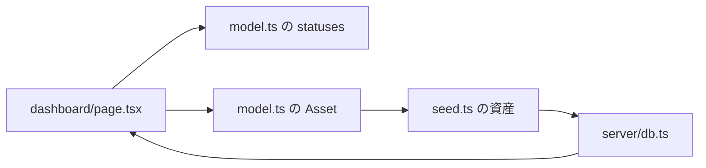

同じページの下には、貸出中と発送中のカードもあります。そちらは貸出と発送の形が要る、別の質問です。件数の塊は、4つの数字が出たところで閉じます。

### カードのリンク先には、URL を条件にするファイルが要る

カードを押すと、アドレスは `/assets?status=available` のような文字列です。計画 42行目は、検索、フィルタ、ソート、ページングを必須にしています。文字列のままでは、資産の配列を絞れません。未知の入力を `AssetQuery` に変える `parseAssetQuery` を `src/domain/schemas.ts` に書きます。ステータスが4つの id のどれでもなければ `"all"` にします。ページの大きさは、この関数が 5 に固定しています。131行目です。5 という数は計画にはありません。

一覧のページは `src/app/(app)/assets/page.tsx` です。ログインと同じグループなので、未ログインはレイアウトが `/login` へ戻します。ページは URL を `parseAssetQuery` に渡します。28行目から 35行目です。

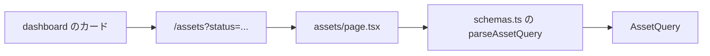

### 条件と資産の配列から、表示する行を決める

`AssetQuery` ができても、どの行を出すかはまだ決まっていません。検索語、カテゴリ、ステータス、並び、ページを資産の規則として1つにします。`queryAssets` は `src/domain/model.ts` の 467行目です。名前とシリアルを検索し、ステータスの並びは id ではなく日本語のラベルで比べます。戻り値は、そのページの `rows`、絞った全体の `total`、`page`、`pageCount` です。

ページは、最初の描画で `queryAssets(db.assets, initialQuery)` を呼びます。47行目です。カードの数字と一覧の `total` は、ここで同じステータスの資産を数えます。画面に出る行は最大 5 件です。6件目以降は次のページです。

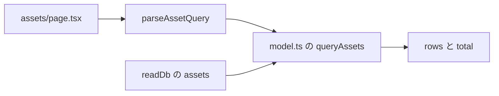

### 条件を変えるたびに、同じ規則をもう一度呼ぶ

検索欄やフィルタを動かす部品は、ブラウザで動きます。`src/components/asset-browser.tsx` です。サーバーのページは、最初の `AssetQuery` と最初の結果をこの部品へ渡します。部品は、条件が変わるたびにアドレスを `/assets` に置き換え、`searchAssets` を呼びます。

`searchAssets` は `src/server/actions.ts` の 67行目です。利用者を読み、`asset.read` が無ければ空の結果を返します。今の4ロールは、どれも `asset.read` を持っています。許可があるときは、もう一度 `parseAssetQuery` してから `queryAssets` を呼びます。URL から来た条件と、ブラウザから来た条件が、同じ関数を通ります。

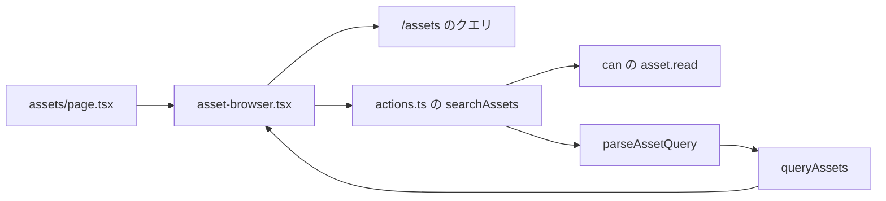

一覧の塊は、カードを開いたステータスの資産だけが出て、`total` がその件数と一致するところで閉じます。該当が 0 件のときは「該当する資産がありません」です。

追加ボタンと、ダッシュボードの貸出中カードから先は、次の節です。

## 登録と、貸出中カードから先を足す

質問は同じです。この画面が仕事を終えるには、まだ手元にないものは何か。ここからは、新しい保存経路を作りません。操作は `Command` の1種類にして、既存の `commit` に渡します。`commit` は `src/server/actions.ts` の 29行目です。ロールを `capabilityFor` で確認し、`applyCommand` が成功したら `writeDb` します。

### 登録ダイアログは、利用可能な資産を1件増やす

一覧の「資産を登録」は、`can(role, "asset.write")` が真のときだけ出ます。`src/components/asset-browser.tsx` の 109行目です。今の表でこの許可を持つのは `admin` と `manager` です。`warehouse` と `viewer` にはボタンがありません。

ダイアログは名前、シリアル、カテゴリ、拠点、メモを集めます。拠点の選択肢は、ページが既に読んでいる `db.locations` です。ステータスはフォームにありません。新しい資産は「利用可能」から始まると、ダイアログの文が書いてあります。

入力はブラウザの外から来るので、`createAssetSchema` を `src/domain/schemas.ts` の 91行目に置きます。名前とシリアルは空にできず、拠点 id は `loc_` の形だけを通します。ダイアログはこのスキーマで送信前に止めます。`createAsset` は 75行目で、同じスキーマをサーバーでもう一度かけます。

通った値に、フォームは id を付けません。`mintId` が `ast_` の新しい id を作ります。`commit` へ渡す `Command` は `create-asset` です。`capabilityFor` はこれを `asset.write` に対応させます。`applyCommand` は 236行目で、名前とシリアルが空でないこと、シリアルが重複しないこと、拠点が実在することを見て、ステータス `available` と貸出先 `null` の資産を配列へ足します。

成功するとダイアログは閉じ、一覧の検索結果を読み直します。失敗すると、返った文をダイアログの中に出します。この塊は、一覧に利用可能な資産が1件増えたところで閉じます。

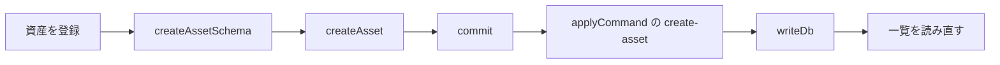

### 貸出中と発送中のカードは、開いている行を見せる

ダッシュボードの下段は、件数の4枚とは別の質問です。貸出中カードは、`returnedAt` が `null` の貸出だけを出します。`src/app/(app)/dashboard/page.tsx` の 20行目です。各行は資産名と貸出先を出し、`/assets/` にその資産 id を付けてリンクします。発送中カードは、ステータスが `open` の発送だけを出します。宛先の拠点名を出し、リンク先は `/shipments` です。

このカードを描くには、`Loan` と `Shipment` が `model.ts` に要ります。デモで空にしないなら、`seed.ts` に返却前の貸出と、到着前の発送を足します。カード自身は行を作りません。0件のときは「貸出中の資産はありません」または「発送中の資産はありません」です。カードの塊は、開いている行が並んだところで閉じます。

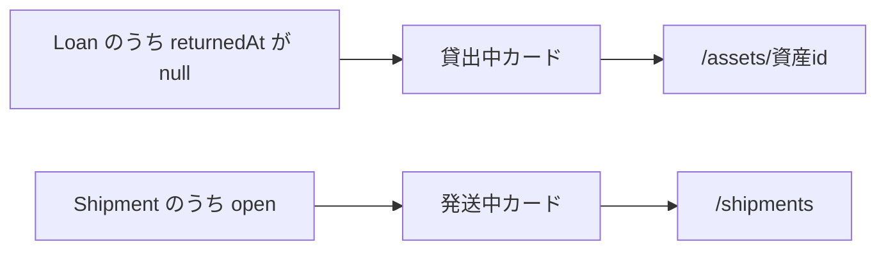

README は、貸出の独立した画面を作らない、と書いてあります。貸出と返却は資産の詳細で行い、到着は `/shipments` で記録します。カードのリンクは、その次の画面を指しています。

### 資産の詳細は、今のステータスで出せる操作だけを出す

一覧や貸出中カードが開くページは `src/app/(app)/assets/[id]/page.tsx` です。アドレスの id が `ast_` の形でなければ `notFound` です。形は合っていても台帳に無ければ、同じく `notFound` です。

ページは3つの許可を見ます。`asset.write`、`asset.status`、`shipment.write` です。フォームは、許可とその資産の今のステータスが両方そろったときだけ出します。

- `asset.write` なら、名前、シリアル、カテゴリ、メモを `updateAsset` へ送る。
- `asset.status` かつ利用可能なら、貸出先を `loanAsset` へ送る。
- `asset.status` かつ貸出中なら、`returnAsset` へ送る。
- `shipment.write` かつ利用可能なら、今の拠点以外を宛先にして `shipAsset` へ送る。
- `asset.status` かつ利用可能または貸出中なら、`stopAsset` へ送る。
- `asset.status` かつ利用停止なら、`restoreAsset` へ送る。
- `asset.write` かつ利用可能なら、`deleteAsset` へ送る。

これらのフォームは Zod を通しません。隠した id は、このページが読んだ資産から書いています。貸出先や宛先や停止理由は、各 action が `Command` に詰めて `commit` へ渡します。許可が無ければ `commit` が「この操作は今のロールではできません」と返します。ステータスが違えば `applyCommand` が拒否します。ボタンを隠す条件と、コマンドが拒否する条件は、同じ遷移です。

`loan` は 285行目です。利用可能な資産だけを貸し、貸出先が空なら失敗します。成功すると資産は `on_loan` になり、`returnedAt` が `null` の貸出が1件増えます。ダッシュボードの貸出中カードは、この行を次に描きます。

`return-asset` は、貸出中だけを受けます。資産は `available` に戻り、貸出先は `null` になり、開いていた貸出の `returnedAt` に日時が入ります。

`ship` は 323行目です。利用可能な資産だけを、実在して、かつ今の拠点と違う宛先へ出します。資産は `in_shipment` になり、`open` の発送が1件増えます。発送中カードは、この行を次に描きます。

`stop` は利用可能または貸出中を `unavailable` にします。開いていた貸出には返却日時を入れます。`restore` は利用停止だけを `available` に戻します。`delete-asset` は利用可能な資産だけを配列から外します。

詳細の塊は、今のステータスに対するボタンだけが見え、押したあとにステータスと貸出または発送の行がコマンドどおり変わるところで閉じます。失敗した文は、同じ詳細の `?error=` に載ります。

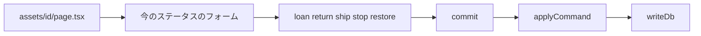

### 到着は発送一覧で記録し、残りの画面も同じ commit を使う

発送中カードが開く `src/app/(app)/shipments/page.tsx` は、発送を新しい順に出します。検索語 `q` は資産名とシリアルにかけます。この絞り込みは `queryAssets` を使いません。ページが配列をその場で濾します。

`open` かつ `shipment.write` の行だけが「到着を記録」を出します。91行目です。`receiveShipment` は `receive` コマンドを `commit` します。`applyCommand` は 347行目で、輸送中の発送と、発送中の資産が両方あることを見ます。成功すると発送は `delivered` になり、資産は `available` で宛先の拠点へ移ります。発送中カードからその行は消えます。


拠点、ユーザー、設定も、別の保存関数は持ちません。それぞれのフォームが、対応する `Command` を同じ `commit` に渡します。

- 拠点の追加、更新、削除は `location.write` です。今の表では `admin` だけです。資産が残る拠点の削除は、`applyCommand` が拒否します。
- ユーザー一覧は `user.read` が要ります。`admin` と `manager` だけです。それ以外には「ユーザー一覧は開けません」を出します。ロール変更は `user.write` で、`admin` だけです。最後の `admin` を外す変更は拒否します。
- 設定の保存は `settings.write` で、`admin` だけです。組織名が空なら、action が `commit` の前に戻します。デモを最初の行へ戻す `resetDemo` だけは `Command` を通りません。`settings.write` を見たあと、`seedDatabase` の結果を `writeDb` します。

計画の8画面は、ここで一通りの操作を持ちます。新しい塊を足すときの質問は、まだ同じです。その画面にまだ無い行や許可は何か。答えが既存の `Command` なら、フォームと action を足します。答えが新しい遷移なら、`Command` と `applyCommand` の分岐を1つ足してから、ボタンを出します。

## `(app)` は URL に出さず、`[id]` は URL の1区切りを受ける

App Router では、`src/app` のフォルダ名がアドレスになります。例外が2つあります。この版の説明は `node_modules/next/dist/docs/01-app/03-api-reference/03-file-conventions/route-groups.md` と `dynamic-routes.md` です。

丸括弧のフォルダは Route Group です。`(app)` という名前はアドレスに入りません。`src/app/(app)/dashboard/page.tsx` のアドレスは `/dashboard` です。`/app/dashboard` にはなりません。括弧を外して `src/app/app/dashboard` にすると、アドレスは `/app/dashboard` になります。

このグループの意図は、ログイン済みの画面だけにレイアウトを掛けることです。`src/app/(app)/layout.tsx` は `requireUser` を呼び、ナビゲーションの `AppShell` で包みます。グループの外にあるのは `src/app/login/page.tsx` と `src/app/page.tsx` です。ログイン画面をこのレイアウトの中に置くと、未ログインで `/login` へ戻した先が、また同じ `requireUser` を呼びます。`/` は利用者の有無で `/dashboard` か `/login` へ移すだけで、殻は出しません。全ページ共通の HTML とフォントは、グループの外の `src/app/layout.tsx` です。

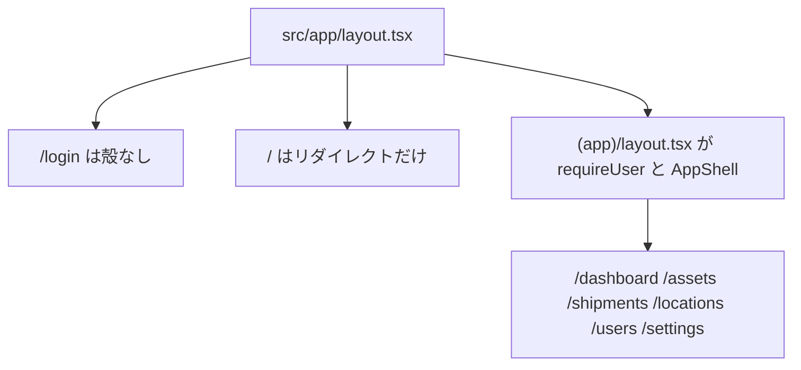

角括弧は、Pages Router のころからある動的セグメントです。フォルダ名 `[id]` はアドレスに文字どおり出ません。その位置の1区切りを `params.id` として受け取ります。`/assets/ast_01` は `src/app/(app)/assets/[id]/page.tsx` に渡り、`params` は `{ id: "ast_01" }` です。ページはその文字列を `asAssetId` に渡し、形が違うか台帳に無ければ `notFound` を呼びます。隣の `not-found.tsx` は、そのときに「資産が見つかりません」を出します。このファイルも `(app)` の中なので、殻は付いたままです。

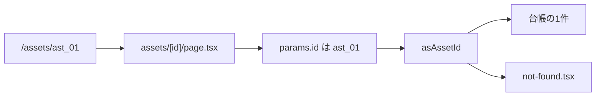

丸括弧をフォルダ名に使わなかった認識は、App Router より前の置き方と一致します。角括弧の `[id]` は、その前の `pages` ディレクトリでも同じ役割でした。

## 作者が書いた分担

作者がフォルダの分担を書いた文は README の 29行目です。画面は `src/app` にあります。権限と資産の状態遷移は `src/domain/model.ts` にまとめてあります。Server Actions は `src/server/actions.ts` で、操作の前にロールを確認し、そのあとドメインのコマンドを適用します。この文はコミット `7d62e7e` で、コードと同時に入っています。

「データの形は domain、入口の検査は app と server」は、この3文より広い言い方です。入力の形を定義する Zod は `src/domain/schemas.ts` にあります。`safeParse` を呼ぶのは `src/server/actions.ts` と `src/server/db.ts` の 12行目です。資産作成ダイアログは `src/components/asset-browser.tsx` の 222行目で、同じ `createAssetSchema` をクライアントの検証に使います。資産一覧は `src/app/(app)/assets/page.tsx` の 28行目で `parseAssetQuery` を呼びます。ページ自身は `safeParse` していません。

`applyCommand` は `src/domain/model.ts` の 237行目で、名前とシリアルが空なら失敗を返します。貸出の `loanAsset` はスキーマを通さず `commit` します。設定保存は `updateSettings` の中で組織名の空を見ています。

計画の「ドメイン」はフォルダ名ではありません。`docs/portfolio-plan.md` の 44行目から 46行目は、ポートフォリオ用 SaaS の資産カテゴリと RBAC の粒度だと書いてあります。この計画は `a6ceeb4`（2026-10-06）で入っており、`src/domain` より前です。計画が名前を出している技術は、Zod、バリデーション、Server Actions です。34行目と 42行目です。フォルダ構成は書いてありません。

Next.js が `src/domain` というフォルダ名を要求した記録はありません。GitHub の課題と Pull Request にも、この分割の理由を書いたものはありませんでした。2026-10-09 の調査では、開いているものも閉じたものも 0 件でした。

README の「ロールを確認してからドメインのコマンドを適用する」と、49行目の「`npm test` が権限と状態遷移を検証する」は、規則を Next.js の外に置いて検証する読み方と整合します。作者がその目的でフォルダを分けた、という文はありません。

## ファイルが揃ったあと、操作を1本追う

画面ができてから読むときは、ファイルの上からではなく、ユーザーの操作を1本追います。ログイン、資産の検索、貸出、返却、発送、到着、拠点の追加、ロール変更、設定の保存、デモのリセットです。それぞれを、画面のイベントから Server Action、スキーマ、`applyCommand`、`data/store.json`、再描画まで通します。止めて読む行は、その関数の分岐と、そこで守っている条件です。

`src/components/ui` は、空行を除いた行数の合計で約1,485行あります。ボタンやダイアログは、画面が渡している props の意味が分かったところで止めます。

読む順は次のとおりです。

1. データの形。`src/domain/model.ts` の先頭から `Database` まで。終わりに `src/domain/seed.ts` のデモデータと、画面に出る名前が一致するかを見ます。
2. 権限と状態。`can` は 98行目、`Command` は 160行目、`applyCommand` は 234行目です。終わりに `npm test` を実行します。
3. 入口。`src/domain/schemas.ts`、`src/server/actions.ts`、`src/server/db.ts`、`src/server/session.ts`、`src/proxy.ts`。最初の操作はログインです。
4. 画面。`/dashboard`、`/assets`、`/assets/[id]`、`/shipments`、`/locations`、`/users`、`/settings`。各画面では、どのコマンドを投げるかを読みます。

| 案 | 1回で説明が終わるもの | その回のあと残るもの |
|---|---|---|
| ファイルを上から | そのファイルの字面 | 1つの操作が複数ファイルにまたがるので、ファイルを読み終えても挙動が閉じない |
| 操作を1本ずつ | その操作の挙動と、コードがそこにある理由 | ui 部品の内部と、Next が生成するファイル |
| URL ごと | その URL の表示 | 複数の画面が同じ `Command` を呼ぶので、権限の説明が画面の数だけ繰り返される |

この読み方は、ファイルが揃ったあとのものです。着手の最初の技は、前の節の仕分けと、画面にまだ無いものを1つずつファイルにすることです。
