# 機材ヤードを、画面の順に読む

この文書は、業務機器の貸出と発送を管理するアプリ「機材ヤード」を、ファイルができた順の考え方で説明します。想定している読者は、IT の基本的な言葉は知っていて、いま React に取り組み始めた人です。React の言葉は、このアプリで最初に出てきたところで説明します。

短いメモは `docs/first-slice-thinking.md` にあります。会話の全文は `docs/chats/` に残ります。この文書は、その一連の説明を初級者向けの詳しさで書き直したものです。

コードは 2026-10-08 のコミット `7d62e7e` に、まとめて入っています。この文書の順は git の履歴ではありません。設計書 `docs/portfolio-plan.md` の 118行目と、各ファイルが実際に読んでいるものから組んでいます。118行目は、ログインとダッシュボードから作り、役割ごとの許可を先に固める、と書いてあります。

起動は README のとおりです。リポジトリのルートで `npm install` のあと `npm run dev` を実行し、ブラウザで http://localhost:3000 を開きます。

## このアプリは何をするか

ノート PC、計測器、工具などの機材が、いまどこにあり、誰に貸し、どこへ送ったかを1つの台帳で見ます。使う人は4つの役割です。

| 画面での名前 | コードの id | デモのメール | パスワード |
|---|---|---|---|
| Admin | `admin` | admin@yard.example | yard-admin |
| Manager | `manager` | manager@yard.example | yard-manager |
| Warehouse | `warehouse` | warehouse@yard.example | yard-warehouse |
| Viewer | `viewer` | viewer@yard.example | yard-viewer |

ログイン画面のボタンからも、同じアカウントで入れます。Admin は利用者と設定を含め、ほぼ全部を変更できます。Manager は資産と発送を変更でき、利用者の一覧は見られます。Warehouse は貸出、返却、発送、到着を記録できます。Viewer は見るだけです。細かい対応は、あとで出てくる `can` が1か所に持っています。

## コードの前に、設計書の文を分ける

設計書は `docs/portfolio-plan.md` です。ここに「最初の公開で作るもの」と「あとで作るもの」と「まだ決めていないこと」が混ざっています。文を1つ取り、次の4つのどれかに置きます。

- **今回.** 「初回公開」「Phase 1」「決定済み」と書いてあるもの。最初に動く画面へ入れます。Phase 1 は、最初の公開範囲という意味です。
- **後続.** 「第2段階」「初回に含めない」と書いてあるもの。いまのリポジトリには入れません。
- **未決.** 「未決」「要確認」と書いてあるもの。実装の前提にしません。
- **計画とコードのずれ.** 計画は必須なのに、今の README が「まだやっていない」と書いているもの。コードが省略したことを、計画の決定として覚えません。

| 文 | 印 | 根拠 |
|---|---|---|
| 初回は Phase 1 のみ。Stripe と AI は入れない | 今回の制約 | 21行目。2026-10-05 の決定 |
| 必須画面は `/login` から `/settings` まで8つ | 今回の成果物 | 40行目 |
| `/login` と `/dashboard` から作り、役割の骨格を先に固める | 最初に動かすもの | 118行目 |
| OpenAI、Stripe、Resend | 後続 | 38行目。初回公開のあと |
| Supabase | 計画では必須。今のコードは未接続 | 計画 32行目。README は未接続と書いている |
| 応募チャネル、週の稼働、海外案件をいつ始めるか | 未決 | 126行目から128行目 |

Supabase は、データベースとログインを預ける外部サービスです。計画の技術一覧には入っています。今のアプリは、認証情報がないため、プロジェクトの `data/store.json` という1つの JSON ファイルに台帳を書いています。JSON は、項目名と値をテキストで並べた形式です。このファイルは git に含めません。最初の起動で `src/domain/seed.ts` のデモデータが作られます。JSON 保存は計画が指定した形ではなく、今のコードが採った代替です。

計画の日付は 2026-10-04 と 2026-10-05 です。アプリのコードはそのあとの `7d62e7e` です。設計書が先にあるので、プロジェクトを作るコマンドより、この仕分けが先です。

仕分けのあと、作るものは3段です。

1. 今回に入った Next.js、TypeScript、Tailwind CSS、shadcn/ui だけを足します。Stripe や AI 用のパッケージは入れません。Next.js は React でページを作る枠組みです。TypeScript は、データの形を書いておく JavaScript です。Tailwind CSS は、画面の余白や色をクラス名で指定する CSS です。shadcn/ui は、ボタンや入力欄などの部品集で、`src/components/ui` に入っています。
2. 最初に動かすのはログイン、ダッシュボード、役割の許可です。資産の貸出や発送は、そのあとです。
3. その最初の塊が使うファイルだけを作ります。画面は `src/app`、許可と状態の変化は `src/domain/model.ts`、保存の前の役割確認は `src/server/actions.ts` です。README の 29行目が、この3つを書いています。

## ファイルを足すときに繰り返す質問

質問は1つです。この画面が仕事を終えるには、まだ手元にないものは何か。

ないものが画面なら、ページのファイルを書きます。ないものが「誰か」や「その人の許可」なら、その形を持つファイルを先に書きます。ないものが保存された行なら、保存を書きます。未ログインの人がログインへ戻り、ログインした人の名前がダッシュボードに出るところまで来たら、最初の仕事は終わりです。資産の件数は、その次の質問です。

## この文書で繰り返す言葉

**ブラウザとサーバー.** ブラウザは、あなたが見ている画面です。サーバーは、`npm run dev` で動いている Node.js のプロセスです。このアプリでは、台帳の読み書きはサーバーだけが行います。ブラウザは、サーバーが組み立てた画面を受け取り、検索欄のような操作を担当します。

**URL.** ブラウザのアドレスです。`/login` のように、サイト名のあとの部分をパスと呼びます。`?status=available` のように `?` のあとへ付く名前と値を、クエリと呼びます。パスは「どのページか」、クエリは「そのページへの条件」です。

**コンポーネント.** 画面の一部を返す関数です。React は、その戻り値を見て実際の画面を作ります。ボタンも、ダッシュボード全体も、コンポーネントです。

**props.** 親のコンポーネントが子へ渡す値です。資産一覧のページは、検索条件と最初の結果を `AssetBrowser` へ props として渡します。

**レイアウト.** 中のページが変わっても残る外枠です。このアプリのログイン後の外枠は、左のメニューと、ログイン中の名前です。

**クッキー.** ブラウザが覚えて、次のリクエストに添える小さな値です。このアプリのクッキー名は `yard_session` で、中身は利用者の id です。パスワードそのものは入れません。

**サーバーアクション.** ブラウザのフォームやボタンから呼べる、サーバー側の関数です。ファイルの先頭に `"use server"` と書いてある `src/server/actions.ts` にまとまっています。

**型.** TypeScript が「この値は利用者だ」「この値は資産だ」と区別するための名前です。編集中のチェックに使います。ブラウザから届いた生の文字列は、型を書いただけでは安全になりません。

**Zod.** 外から来た値が、期待した形かどうかを実行時に調べるライブラリです。このアプリでは `src/domain/schemas.ts` に検査の定義があります。`safeParse` は、その検査を実行する関数です。成功なら中の値を使い、失敗ならエラーにします。

**コマンド.** 台帳への変更を、名前つきの1件にしたものです。例は「この資産を貸す」「この発送を到着にする」です。TypeScript では `Command` という型です。画面はコマンドを組み立て、規則の本体は `applyCommand` が持っています。

## フォルダ名の `(app)` と `[id]`

`src/app` の下のフォルダ名は、ふつうそのまま URL になります。`src/app/login/page.tsx` は `/login` です。例外が2つあります。説明の原文は、このプロジェクトに入っている `node_modules/next/dist/docs/01-app/03-api-reference/03-file-conventions/route-groups.md` と `dynamic-routes.md` です。

**丸括弧は、URL に出さないグループです.** `(app)` というフォルダ名はアドレスに入りません。`src/app/(app)/dashboard/page.tsx` のアドレスは `/dashboard` です。括弧を外して `src/app/app/dashboard/page.tsx` にすると、アドレスは `/app/dashboard` になります。括弧付きのフォルダを、Next.js は Route Group と呼びます。古い `pages` ディレクトリの置き方には、この丸括弧はありません。使っていなかった認識は、その置き方と一致します。

このアプリがグループを作った理由は、ログイン後の画面だけにメニューを掛けるためです。`src/app/(app)/layout.tsx` は、クッキーから利用者を読む `requireUser` を呼び、いなければ `/login` へ戻します。利用者がいれば、左メニューの `AppShell` で包みます。`AppShell` は `src/components/app-shell.tsx` です。中身はダッシュボード、資産、発送、拠点、ユーザー、設定へのリンクと、ログイン中の名前、ログアウトです。

グループの外にあるページは2つです。`src/app/login/page.tsx` はログイン画面です。これをグループの中に置くと、未ログインで `/login` へ戻した先が、また `requireUser` を呼び、戻る動作が終わりません。`src/app/page.tsx` は `/` です。利用者がいれば `/dashboard`、いなければ `/login` へ移すだけで、メニューは出しません。

全ページに共通なのは、さらに外の `src/app/layout.tsx` です。ここが HTML の外側、日本語の指定、フォント、暗い配色を担当します。ログイン画面にも、ログイン後の画面にも付きます。

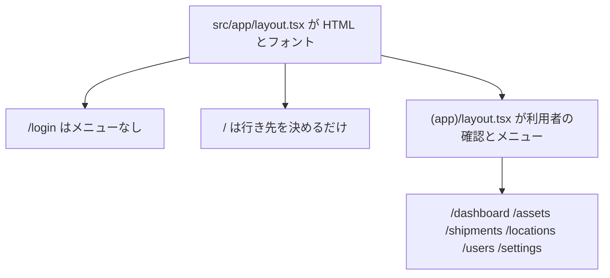

**角括弧は、URL の1区切りを受け取る枠です.** `[id]` という文字はアドレスに出ません。その位置にある文字列が `params.id` になります。`/assets/ast_01` は `src/app/(app)/assets/[id]/page.tsx` に渡り、`params` は `{ id: "ast_01" }` です。この角括弧は、App Router より前の `pages` ディレクトリでも、同じ役割で使われていました。

ページはその文字列を `asAssetId` に渡します。`ast_` で始まる形でなければ、そこで失敗します。形は合っていても台帳にその id が無ければ、ページは `notFound()` を呼びます。隣の `src/app/(app)/assets/[id]/not-found.tsx` が「資産が見つかりません」と「一覧へ戻る」を出します。このファイルも `(app)` の中なので、メニューは付いたままです。

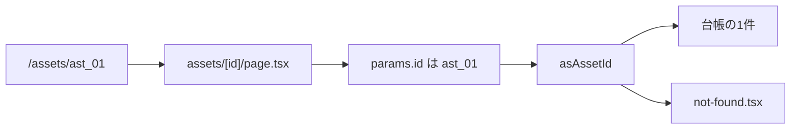

## ログインして、名前が出るまで

最初に開く画面はログインです。ファイルは `src/app/login/page.tsx` です。入れたあとに見る画面はダッシュボードです。ファイルは `src/app/(app)/dashboard/page.tsx` です。先にこの2つが要ります。

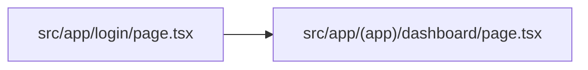

ダッシュボードは「青木 蓮 さん、今日の台帳です。」のように、見ている人の名前を出します。名前はページの中には書いてありません。クッキーから利用者を読む関数が要ります。それが `src/server/session.ts` の `requireUser` です。

```ts
export async function requireUser(): Promise<User> {
  const user = await currentUser();
  if (!user) redirect("/login");
  return user;
}
```

25行目から 28行目です。`currentUser` はクッキーの値を読み、`usr_` の形でなければ利用者なしとします。形が合っていても、台帳の利用者一覧にその id が無ければ、やはり利用者なしです。`requireUser` は、利用者なしならブラウザを `/login` へ移します。この確認は `(app)` のレイアウトが先に行い、ダッシュボード自身も同じ関数を呼びます。レイアウトはメニュー用、ページは「この画面に名前を出す」用です。

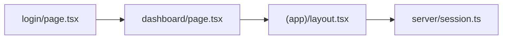

利用者が読める、と分かった時点で、その人が何を許されるかも要ります。計画の 104行目から 113行目が、4つの役割と「役割と操作の対応で十分」と書いてあります。画面ごとに `if (role === "admin")` を書くと、同じ条件が画面の数だけ増えます。先に `src/domain/model.ts` へ `User` と `can` を書きます。

```ts
export function can(role: RoleId, capability: Capability): boolean {
  return roleCapabilities[role].includes(capability);
}
```

98行目から 100行目です。`capability` は許可の名前です。例は `asset.read`（資産を見る）や `asset.write`（資産の台帳を直す）です。`can("viewer", "asset.write")` は false です。後の画面は、ボタンを出すかどうかでこの関数を呼びます。

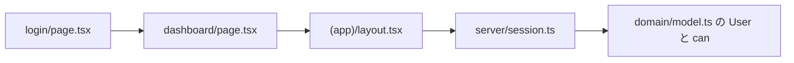

ログインのフォームは、入力したメールとパスワードを、誰かの行と照合できないと終わりません。行の置き場が次のファイルです。計画なら Supabase です。今のコードは `src/domain/seed.ts` のデモ利用者と、`src/server/db.ts` の `readDb` です。`readDb` は `data/store.json` を読み、中身が無いか壊れていればデモデータで作り直します。

照合してクッキーを書くのが、`src/server/actions.ts` の `login` です。メールとパスワードの形は、先に `loginSchema` で調べます。一致する利用者がいれば、クッキーにその人の id を入れ、`/dashboard` へ移します。いなければ `/login?error=credentials` へ戻します。

クッキーが無い人が `/dashboard` を直接開いたときは、ページより前に `src/proxy.ts` が `/login` へ戻します。`proxy` が見るのは、クッキーがあるかないかだけです。中身が壊れた id は、そのあと `requireUser` が台帳と照合し、利用者が見つからなければやはり `/login` へ戻します。

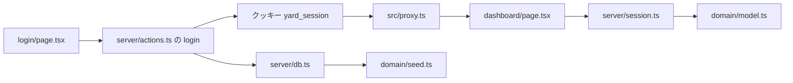

ここまでで、未ログインはログイン画面へ戻り、ログインするとダッシュボードに名前が出ます。最初の仕事はここで終わりです。ダッシュボードは名前の下に件数も出します。それは次の節です。

## 4つの件数

ダッシュボードは、利用可能、貸出中、発送中、利用停止の4枚のカードに数字を出します。名前だけではこの数字は出ません。要るのは、4つのステータスの一覧と、各資産がどれか1つを持っていることです。

ステータスと資産の形は `src/domain/model.ts` にあります。資産 `Asset` は、id、名前、カテゴリ、ステータス、拠点、シリアル、貸出先、メモを持ちます。id は `ast_` で始まります。行が無いと件数は 0 なので、`seed.ts` の `seedDatabase` がデモの資産を返します。読み出しは、ログインで既にある `readDb` です。

件数のための別関数は、まだ要りません。ページが、ステータスの id と一致する資産を数えます。

```ts
{statuses.map((status) => {
  const count = db.assets.filter((asset) => asset.status === status.id).length;
```

このコードは `src/app/(app)/dashboard/page.tsx` の 31行目から 32行目です。`map` は、配列の各要素で同じ処理をして、新しい配列を作る書き方です。ここでは4つのステータスそれぞれについて、カードを1枚作っています。カードは `/assets?status=available` のように、その id をクエリにして資産一覧へリンクします。34行目です。

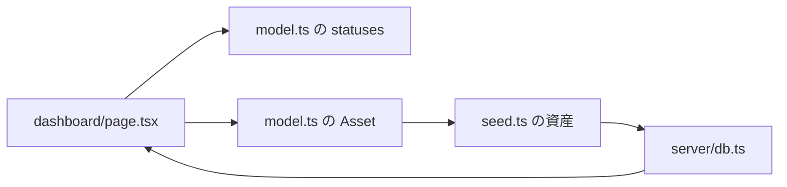

同じページの下には、貸出中と発送中の一覧カードもあります。あれは貸出と発送の行が要る、別の仕事です。件数の仕事は、4つの数字が出たところで終わります。

## 資産一覧

カードを押すと、アドレスは `/assets?status=available` のような文字列です。計画の 42行目は、検索、フィルタ、並び替え、ページ分けを必須にしています。文字列のままでは、資産の配列を絞れません。

`src/domain/schemas.ts` の `parseAssetQuery` が、その文字列を `AssetQuery` に変えます。`AssetQuery` は、検索語、カテゴリ、ステータス、並びの項目、昇順か降順か、ページ番号、1ページの件数をまとめた型です。ステータスが4つの id のどれでもなければ `"all"` にします。知らない値で画面を壊さないためです。1ページの件数は、この関数が 5 に固定しています。131行目です。5 という数は計画には書いてありません。

一覧のページは `src/app/(app)/assets/page.tsx` です。`(app)` の中なので、未ログインはレイアウトが `/login` へ戻します。ページは URL のクエリを `parseAssetQuery` に渡します。28行目から 35行目です。

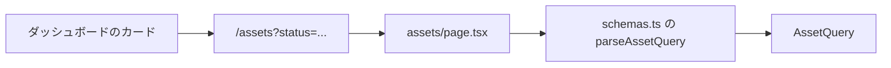

条件ができても、どの行を出すかはまだ決まっていません。検索、カテゴリ、ステータス、並び、ページ分けを、資産の規則として1つの関数にします。それが `src/domain/model.ts` の `queryAssets` で、467行目です。名前とシリアルに検索語が含まれるかを見ます。ステータスで並べるときは、`available` のような id ではなく「利用可能」のような日本語のラベルで比べます。戻り値は4つです。今のページに出す `rows`、条件に合った全体の件数 `total`、ページ番号 `page`、ページ数 `pageCount` です。

ページは最初の表示で `queryAssets(db.assets, initialQuery)` を呼びます。47行目です。ダッシュボードのカードの数字と、一覧の `total` は、同じステータスの資産を数えた結果です。画面に出る行は最大 5 件です。6件目以降は次のページです。

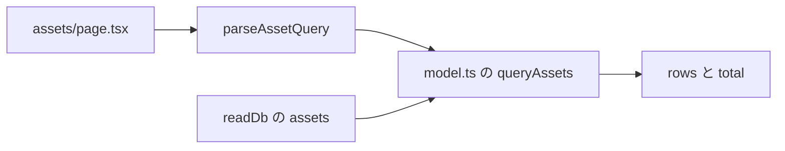

検索欄やフィルタは、文字を入れるたびに動きます。この部分はブラウザで動くコンポーネントです。`src/components/asset-browser.tsx` の先頭に `"use client"` とあります。これは「このファイルはブラウザでも実行する」という印です。サーバーのページは、最初の条件と最初の結果を、props でこの部品へ渡します。

条件が変わると、部品はアドレスを `/assets?...` に書き換え、`searchAssets` を呼びます。`searchAssets` は `src/server/actions.ts` の 67行目です。利用者を読み、`asset.read` が無ければ空の結果を返します。今の4つの役割は、どれも `asset.read` を持っています。許可があるときは、もう一度 `parseAssetQuery` してから `queryAssets` を呼びます。URL から来た条件と、ブラウザから来た条件が、同じ関数を通ります。

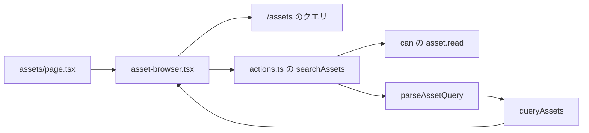

一覧の仕事は、カードを開いたステータスの資産だけが出て、`total` がその件数と一致するところで終わります。該当が 0 件のときは「該当する資産がありません」です。

`src/components/ui` のボタンや表は、約1,485行あります。これは空行を除いた行数の合計です。中身は、画面が渡した文字や、押したときの関数が分かれば、最初は読まなくて大丈夫です。

## 資産を1件登録する

一覧の「資産を登録」は、`can(role, "asset.write")` が真のときだけ出ます。`asset-browser.tsx` の 109行目です。今の許可の表でこれを持つのは `admin` と `manager` です。`warehouse` と `viewer` にはボタンがありません。ボタンが無いだけではなく、サーバーも同じ許可を見ます。ボタンを隠すだけだと、詳しい人が関数を直接呼べば登録できてしまうからです。

ここから先は、保存の通り道を新しく作りません。変更は `Command` の1種類にして、`commit` に渡します。`commit` は `src/server/actions.ts` の 29行目です。やることは4つです。

1. `requireUser` で利用者を読む。
2. `capabilityFor` で、そのコマンドに必要な許可を調べ、`can` で持っているかを見る。無ければ「この操作は今のロールではできません」と返す。
3. `applyCommand` に、今の台帳とそのコマンドを渡す。規則に反すれば、台帳は変えない。
4. 成功したら `writeDb` で `data/store.json` を書き換え、画面を読み直す。

ダイアログが集めるのは、名前、シリアル、カテゴリ、拠点、メモです。拠点の選択肢は、一覧ページが既に読んでいる拠点の配列です。ステータスはフォームにありません。ダイアログの説明文が「登録した資産は利用可能から始まります」と書いています。

入力はブラウザから来るので、`createAssetSchema` を `schemas.ts` の 91行目に置きます。名前とシリアルは空にできず、拠点 id は `loc_` の形だけを通します。ダイアログは送信前にこの検査で止めます。`createAsset` は 75行目で、同じ検査をサーバーでもう一度かけます。ブラウザ側の検査は、間違った入力で往復しないためです。サーバー側の検査は、ブラウザを通さない呼び出しを拒むためです。

フォームは id を送りません。`mintId` が `ast_03` のような新しい id を作ります。`commit` へ渡すコマンドの種類は `create-asset` です。必要な許可は `asset.write` です。`applyCommand` は 236行目で、名前とシリアルが空でないこと、同じシリアルが既に無いこと、拠点が実在することを見ます。通れば、ステータス `available`、貸出先 `null` の資産を配列の末尾へ足します。

成功するとダイアログは閉じ、一覧を読み直します。失敗すると、返った文をダイアログの中に出します。この仕事は、一覧に利用可能な資産が1件増えたところで終わります。

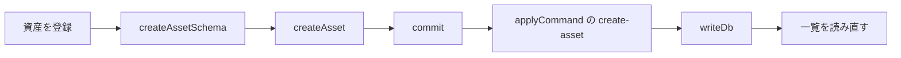

## 貸出中カードと発送中カード

ダッシュボードの下段は、上の4枚の件数とは別です。貸出中カードは、まだ返却日が入っていない貸出だけを出します。コードでは `returnedAt` が `null` です。`null` は「値が無い」という意味です。`dashboard/page.tsx` の 20行目です。各行は資産名と貸出先を出し、`/assets/ast_01` のようにその資産の詳細へリンクします。

発送中カードは、発送の状態が `open`（まだ到着していない）のものだけを出します。宛先の拠点名を出し、リンク先は発送一覧の `/shipments` です。特定の1件ではなく、一覧です。

このカードを描くには、貸出 `Loan` と発送 `Shipment` の形が `model.ts` に要ります。デモで空欄にしないなら、`seed.ts` に返却前の貸出と、到着前の発送を入れます。カード自身は新しい行を作りません。0件のときは「貸出中の資産はありません」または「発送中の資産はありません」です。

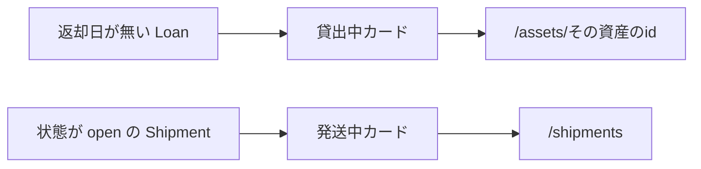

README は、貸出専用の画面は作らない、と書いてあります。貸出と返却は資産の詳細で行い、到着は発送一覧で記録します。カードのリンクは、その次の画面を指しています。

## 資産の詳細で、貸す、返す、送る

詳細のページは `src/app/(app)/assets/[id]/page.tsx` です。アドレスの id が `ast_` の形でなければ `not-found.tsx` です。形は合っていても台帳に無ければ、同じく見つからない画面です。見つかれば、名前、ステータス、シリアル、カテゴリ、拠点、貸出先、メモ、これまでの貸出を出します。

ボタンは、許可と今のステータスが両方そろったときだけ出します。許可は3種類です。

- `asset.write` は、名前やシリアルを直し、利用可能な資産を台帳から外す許可です。`admin` と `manager` が持っています。
- `asset.status` は、貸す、返す、利用停止、利用可能に戻す許可です。`admin`、`manager`、`warehouse` が持っています。
- `shipment.write` は、発送と到着の許可です。この3つの役割が持っています。`viewer` はどれも持っていません。

出るフォームは次のとおりです。

- `asset.write` があるなら、名前、シリアル、カテゴリ、メモの保存。
- `asset.status` があり、いま利用可能なら、貸出先を書いて貸す。
- `asset.status` があり、いま貸出中なら、返却を記録する。
- `shipment.write` があり、いま利用可能なら、今いる拠点以外を選んで発送する。
- `asset.status` があり、利用可能か貸出中なら、利用停止。
- `asset.status` があり、利用停止なら、利用可能に戻す。
- `asset.write` があり、利用可能なら、台帳から外す。

これらのフォームは Zod を通しません。資産 id は、ページが台帳から読んだ値を、隠し項目としてフォームに入れています。利用者が id を打ち直す欄はありません。貸出先、宛先、停止理由は、それぞれのサーバーアクションがコマンドに詰めて `commit` へ渡します。許可が無ければ `commit` が拒否します。ステータスが違えば `applyCommand` が拒否します。ボタンを隠す条件と、コマンドが拒否する条件は、同じ状態の変化です。ボタンは押し間違いを減らし、コマンドは台帳の規則です。

貸す処理は `applyCommand` の 285行目です。利用可能な資産だけを貸し、貸出先が空なら失敗します。成功すると、その資産のステータスは `on_loan` になり、貸出先に名前が入り、返却日が `null` の貸出が1件増えます。ダッシュボードの貸出中カードは、次に開いたときこの行を描きます。

返却は、貸出中の資産だけを受けます。資産は `available` に戻り、貸出先は `null` になり、開いていた貸出の `returnedAt` に日時が入ります。貸出中カードから、その行は消えます。

発送は 323行目です。利用可能な資産だけを、実在して、かつ今いる拠点とは違う宛先へ出します。資産は `in_shipment` になり、状態 `open` の発送が1件増えます。発送中カードは、次にその行を描きます。

利用停止は、利用可能または貸出中を `unavailable` にします。開いていた貸出には返却日時を入れます。復帰は、利用停止だけを `available` に戻します。削除は、利用可能な資産だけを配列から外します。貸出中の資産は、先に返却しないと消せません。

失敗した文は、同じ詳細のアドレスの末尾 `?error=` に載り、ページ上部の通知に出ます。この仕事は、今のステータスに対するボタンだけが見え、押したあとにステータスと貸出または発送の行が、コマンドの規則どおり変わるところで終わります。

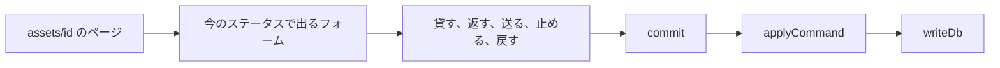

状態の変化を、文章でも書いておきます。

- 利用可能から、貸すと貸出中になる。返すと利用可能に戻る。
- 利用可能から、発送すると発送中になる。到着を記録すると、宛先の拠点で利用可能に戻る。到着の記録は次の節です。
- 利用可能または貸出中から、利用停止にできる。利用停止から、利用可能に戻せる。
- 台帳から外せるのは、利用可能なときだけ。

## 到着、拠点、利用者、設定

発送中カードが開く `src/app/(app)/shipments/page.tsx` は、発送を新しい順に出します。検索欄の `q` は、資産名とシリアルに含まれるかを見ます。この絞り込みは `queryAssets` を使いません。発送のページが、発送の配列をその場で濾します。資産一覧の検索と、発送一覧の検索は、別のコードです。

状態が `open` で、かつ `shipment.write` を持つ行だけに「到着を記録」が出ます。91行目です。押すと `receive` というコマンドが `commit` に渡ります。`applyCommand` は 347行目で、輸送中の発送と、発送中の資産が両方あることを見ます。成功すると発送は到着済み `delivered` になり、資産は `available` で宛先の拠点へ移ります。発送中カードから、その行は消えます。

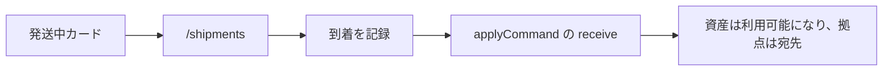

拠点、ユーザー、設定も、別の保存関数は持ちません。フォームが対応するコマンドを、同じ `commit` に渡します。

**拠点**は `/locations` です。追加、名前の変更、削除に必要な許可は `location.write` です。今の表では `admin` だけです。削除のとき、その拠点に資産が1件でも残っていれば `applyCommand` が拒否します。先に資産の拠点を変えるか、資産を外します。

**ユーザー**は `/users` です。一覧を開くには `user.read` が要ります。`admin` と `manager` だけです。それ以外が開くと「ユーザー一覧は開けません」と出ます。役割の変更は `user.write` で、`admin` だけです。最後の1人の Admin を別の役割に変える操作は拒否します。管理者が0人になると、設定を変更できる人がいなくなるからです。

**設定**は `/settings` です。組織名とメモの保存は `settings.write` で、`admin` だけです。組織名が空なら、`commit` の前に「組織名を入力してください」と戻します。ダッシュボードの上部に出る組織名は、ここの値です。デモの最初の状態へ戻すボタンだけは、コマンドを通りません。`settings.write` を確認したあと、`seedDatabase` の結果をそのまま `writeDb` します。登録や貸出のあとで押すと、デモデータに戻ります。

計画にある8つの画面は、ここで一通りの操作を持ちます。画面は `/login`、`/dashboard`、`/assets`、`/assets/` に続く1件、`/shipments`、`/locations`、`/users`、`/settings` です。

次に画面を足すときも、質問は同じです。その画面にまだ無い行や許可は何か。答えが既存のコマンドなら、フォームとサーバーアクションを足します。答えが新しい状態の変化なら、`Command` に種類を1つ足し、`applyCommand` にその分岐を書いてから、ボタンを出します。

## 作者がフォルダについて書いたこと

作者が書いた分担は、README の 29行目の3文です。

- 画面は `src/app` にある。
- 許可と、資産の状態の変化は `src/domain/model.ts` にまとめてある。
- サーバーアクションは `src/server/actions.ts` にあり、操作の前に役割を確認し、そのあとドメインのコマンドを適用する。

この3文は、コードと同じコミット `7d62e7e` で入っています。

「データの形は domain、入口の検査は app と server」という広い言い方は、この3文とは一致しません。検査の定義である Zod は `src/domain/schemas.ts` にあります。それを実行する場所は1つではありません。

- ログイン、資産の登録、資産の更新は、サーバーアクションが `safeParse` を呼ぶ。
- JSON ファイルを読む `readDb` も、`databaseSchema` で中身を調べる。12行目です。
- 資産を登録するダイアログは、ブラウザ側でも同じ `createAssetSchema` を使う。`asset-browser.tsx` の 222行目です。
- 資産一覧のページは、`parseAssetQuery` を呼ぶ。ページ自身は `safeParse` を呼んでいません。

貸出、返却、発送、到着、拠点、役割の変更は、Zod のスキーマを通りません。`commit` と `applyCommand` が、許可と状態を見ます。設定の組織名が空かどうかは、設定のアクションが `commit` の前に見ます。

計画の「ドメイン」という語は、フォルダ名ではありません。`docs/portfolio-plan.md` の 44行目から 46行目は、機材のカテゴリと、役割の粒度のことだと書いてあります。この計画は 2026-10-06 のコミット `a6ceeb4` で入っていて、`src/domain` というフォルダより前です。計画が名前を出している技術は、Zod、入力検査、サーバーアクションです。34行目と 42行目です。フォルダの名前は書いてありません。Next.js も、`src/domain` という名前を要求してはいません。

README の 49行目は、`npm test` が許可と状態の変化を検証する、と書いてあります。画面の操作確認は、開発サーバーを起動してブラウザで各アドレスを開きます。テストが Next.js を起動せずに許可と状態を見られるのは、その規則が `model.ts` の `can` と `applyCommand` にあるからです。作者が「テストのためにフォルダを分けた」と書いた文は、リポジトリにはありません。

## 画面ができてから、操作を1本だけ追う

ファイルを上から全部読むと、1つの操作が複数のファイルに分かれています。1つのファイルを読み終えても、ボタンを押したあとに何が起きるかは閉じません。画面ができてから読むときは、利用者が行う操作を1本だけ追います。

例は、ログイン、資産の検索、登録、貸出、返却、発送、到着、拠点の追加、役割の変更、設定の保存、デモを戻す、です。それぞれを、画面の操作からサーバーアクション、検査、`applyCommand`、`data/store.json`、画面の読み直しまで通します。立ち止まる行は、条件で分岐している行と、そこで守っている規則です。同じファイルの残りは、次の操作が通ったときに読みます。

比べ方は次のとおりです。

| 読み方 | 1回で説明が終わるもの | その回のあと残るもの |
|---|---|---|
| ファイルを上から | そのファイルの文字 | 操作は複数ファイルにまたがるので、1ファイルを読み終えても動作は閉じない |
| 操作を1本ずつ | その操作の動作と、コードがそこにある理由 | ボタン部品の内部と、Next.js が生成するファイル |
| アドレスごと | そのアドレスの表示 | 複数の画面が同じコマンドを呼ぶので、許可の説明が繰り返される |

着手する前の質問は、この節とは別です。先に設計書を分け、画面にまだ無いものを1つずつファイルにします。この節は、ファイルが揃ったあとに使います。
